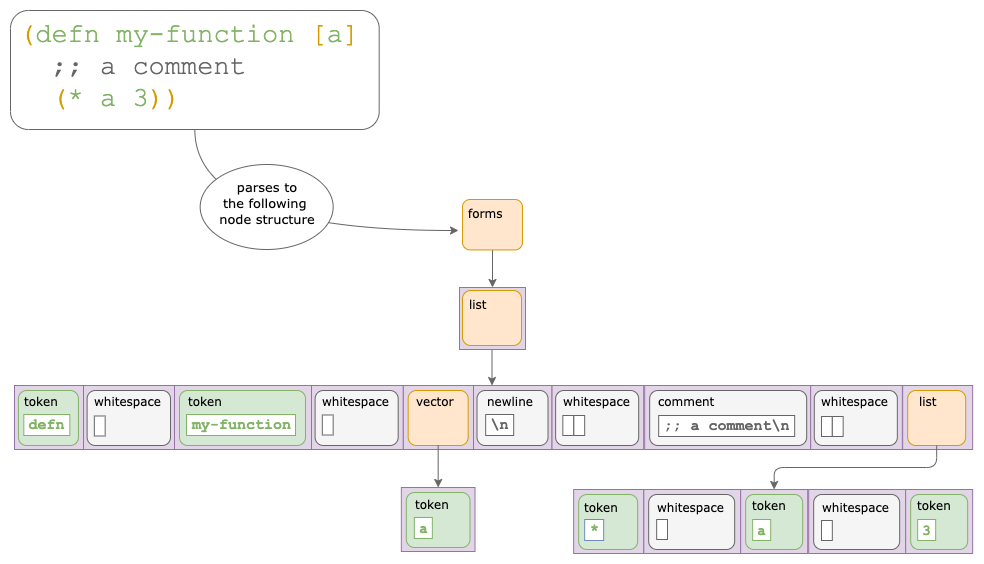

// NOTE: release workflow automatically updates rewrite-clj versions in this file
= User Guide
:cljdoc-host: https://cljdoc.org
:cljdoc-api-url: {cljdoc-host}/d/rewrite-clj/rewrite-clj/CURRENT/api
:toclevels: 5
:toc:

== Introduction
Rewrite-clj is a library that can read, update and write Clojure, ClojureScript and https://github.com/edn-format/edn[EDN] source code while preserving whitespace and comments.

=== Interesting Alternatives
If rewrite-clj is not your cup of tea, consider following alternatives:

|===
| Project | Parsing? | Writing? | Whitespace Perserving? | Includes Element Row/Col?

| https://github.com/carocad/parcera[parcera]
| yes
| yes
| yes
| yes

| https://github.com/borkdude/edamame[edamame]
| yes
| no
| no
| yes

|===

=== History
https://github.com/xsc[@xsc] created https://github.com/xsc/rewrite-clj[rewrite-clj] in 2013.
Its original use was to upgrade dependencies in https://leiningen.org[lein] project.clj files.
The library quickly took off in popularity and is the default choice for modifying Clojure/EDN from Clojure.

https://github.com/rundis[@rundis] created rewrite-cljs in 2015 to match the features of rewrite-clj for ClojureScript developers.
It was originally used for refactoring support in https://github.com/LightTable/LightTable[Light Table].
In January of 2019, @rundis graciously https://github.com/clj-commons/rewrite-cljs[transferred rewrite-cljs to clj-commons].

Seeing an opportunity to give back to the Clojure community, in 2019 https://github.com/lread[@lread], with guidance and help from many friendly Clojurians, started work on rewrite-cljc.
In December of 2020, @xsc graciously https://github.com/clj-commons/rewrite-clj[tranferred rewrite-clj to clj-commons].
So rewrite-cljc is now dead, long live rewrite-clj!

[NOTE]
====
To distinguish the the versions of rewrite-clj, I'll use:

* rewrite-clj v0 to refer to the classic
* rewrite-clj v1 to refer to the reboot

When the distinction is unimportant, I'll simply use rewrite-clj.
====

The goal of rewrite-clj v1 is to provide a thoughtfully maintained feature-complete library that can be used from either Clojure or ClojureScript.
While merging rewrite-clj v0 and rewrite-cljs to create rewrite-clj v1 was not trivial, the real hard work was done over many years in rewrite-clj v0 and rewrite-cljs under the leadership of @xsc and @rundis (thanks guys!).
Read link:design/01-merging-rewrite-clj-and-rewrite-cljs.adoc[Merging rewrite-clj and rewrite-cljs] for details on the merge.

=== Upgrading from rewrite-clj v0 and/or rewrite-cljs
Thanks to @xsc's transfer of rewrite-clj to clj-commons we'll continue on with the rewrite-clj namespace and clojars deploy target.

To upgrade to rewrite-clj v1, update your project dependencies.
If you were using both rewrite-cljs and rewrite-clj v0 in your project you can now drop the rewrite-cljs dependency.

The most notable breaking changes from rewrite-clj v0 relate to handling of namespaced elements:

* Namespaced map handling was incomplete in rewrite-clj, has been reworked a bit and now supports namespaced symbols
* An `sexpr` on a namespaced key or symbol should now work even when navigating down to the key node
* An `sexpr` that involves auto resolve never consults `\*ns*` you can plugin your own auto-resolve behavior, see link:#namespaced-elements[namespaced elements]

Need to know more? link:../CHANGELOG.adoc[See the change log].

=== Conventions
As is a common convention, example code shows results of expression evaluation like so:

[source, clojure]
----
(+ 1 2 3)
;; => 6
----

We show distinctions between Clojure and Clojurescript results like so:
[source, clojure]
----
\c
;; =clj=> \c
;; =cljs=> "c"
----

And we show output like so:
[source, clojure]
----
(println "hello there")
;; =stdout=>
; hello there
----

=== Terminology

Rewrite-clj has an `sexpr` function that returns Clojure forms.
Our usage of the terms "s-expression" and "forms" might be less nuanced than some formal definitions.
I think we are in line with https://www.braveclojure.com/do-things/#Forms[Clojure for the Brave and True's description of forms].
To us, a Clojure form is any parsed (but not evaluated) Clojure as it would be returned by the Clojure reader.

[#nodes]
=== Rewrite-clj Nodes

Rewrite-clj parses Clojure source into rewrite-clj nodes.

While reviewing the following example, it helps to remember that Clojure source is data.

Each node carries the positional metadata `:row`, `:col`, `:end-row` and `:end-col`.
The positional data is 1-based and `:end-col` is exclusive.

You can link:#parser-api[parse] and work with link:#node-api[nodes] directly or take advantage of the power of the link:#zip-api[zip API].

Rewrite-clj offers easy conversion from rewrite-clj nodes to Clojure forms and back.
This is convenient but does come with some caveats.
As you get more experienced with rewrite-clj, you will want to review link:#sexpr-nuances[sexpr nuances].

== Project Setup

=== Tools Deps
Include the following dependency in your `deps.edn` file:
//:test-doc-blocks/skip
// NOTE: the version in this snippit is automaticaly updated by our release workflow
[source,clojure]
----
rewrite-clj/rewrite-clj {:mvn/version "0.6.1"}
----

=== Leiningen
Include the following dependency in your `project.clj` file:
//:test-doc-blocks/skip
// NOTE: the version in this snippit is automatically update by our release workflow
[source,clojure]
----
[rewrite-clj/rewrite-clj "0.6.1"]
----

== Rewrite-clj APIs
There are 4 public API namespaces:

. `rewrite-clj.zip`
. `rewrite-clj.parser`
. `rewrite-clj.node`
. `rewrite-clj.paredit`

[#zip-api]
=== Zip API
Traverse and modify Clojure/ClojureScript/EDN.
This is considered the main rewrite-clj API and might very well be all you need.

You'll optionally use the link:#node-api[node API] on the rewrite-clj nodes in the zipper.

==== A Brief Introduction to Zippers

[TIP]
====
Rewrite-clj uses a customized version of
https://clojure.github.io/clojure/clojure.zip-api.html[Clojure's clojure.zip].
If you are not familiar with zippers, you may find the following resources helpful:

* https://clojure.org/reference/other_libraries#_zippers_functional_tree_editing_clojure_zip[Clojure overview of zippers]
* https://lambdaisland.com/blog/2018-11-26-art-tree-shaping-clojure-zip[Arne Brasseur - The Art of Tree Shaping with Clojure Zippers]
* https://tbaldridge.pivotshare.com/media/zippers-episode-1/11348/feature?t=0[Tim Baldrige - PivotShare - Series of 7 Videos on Clojure Zippers]
====

At a conceptual level, the rewrite-clj zipper holds:

* a tree of rewrite-clj nodes representing your parsed Clojure source
* your current location within the zipper

Because the zipper holds both the tree and your location within the tree, its variable is commonly named `zloc`.
The zipper is immutable, as such, location changes and node modifications are always returned in a new zipper.

You may want to refer to link:#nodes[rewrite-clj nodes] while reviewing this introductory example:

[source,clojure]
----
(require '[rewrite-clj.zip :as z])

;; define some test data
(def data-string
"(defn my-function [a]
  ;; a comment
  (* a 3))")

;; parse code to nodes, create a zipper, and navigate to the first non-whitespace node
(def zloc (z/of-string data-string))

;; explore what we've parsed
(z/sexpr zloc)
;; => (defn my-function [a] (* a 3))
(-> zloc z/down z/right z/node pr)
;; =stdout=>
; <token: my-function>
(-> zloc z/down z/right z/sexpr)
;; => my-function

;; rename my-function to my-function2 and return resulting s-expression
(-> zloc
    z/down
    z/right
    (z/edit (comp symbol str) "2")
    z/up
    z/sexpr)
;; => (defn my-function2 [a] (* a 3))

;; rename my-function to my-function2 and return updated string from root node
(-> zloc
    z/down
    z/right
    (z/edit (comp symbol str) "2")
    z/root-string
    println)
;; =stdout=>
; (defn my-function2 [a]
;   ;; a comment
;   (* a 3))

----

[TIP]
====
The zip location movement functions (`right`, `left`, `up`, `down`, etc) skip over Clojure whitespace nodes and comment nodes.
Remember that Clojure whitespace includes commas.

If you want to navigate over all nodes, use the `+*+` counterparts (`right*`, `left*`, `up*`, `down*`, etc).
====

See link:{cljdoc-api-url}/rewrite-clj.zip[zip API docs].

==== Finding Elements with the Zip API

The `rewrite-clj.zip` namespace includes find operations to navigate to locations of interest in your zipper.
Let's assume you want to modify the following minimal `project.clj` by replacing the `:description` placeholder text with something more meaningful:

//:test-doc-blocks/skip
.project.clj snippet
[source, clojure]
----
(defproject my-project "0.1.0-SNAPSHOT"
  :description "Enter description")
----

Most find functions accept an optional location movement function.
Use:

* `rewrite-clj.zip/right` (the default) - to search sibling nodes to the right
* `rewrite-clj.zip/left` to search siblings to left
* `rewrite-clj.zip/next` for a depth-first tree search

[source,clojure]
----
(require '[rewrite-clj.zip :as z])

;; for sake of a runnable example we'll load from a string:
(def zloc (z/of-string
"(defproject my-project \"0.1.0-SNAPSHOT\"
  :description \"Enter description\")"))

;; loading from a file, looks like so:
;; (def zloc (z/of-file "project.clj")) ;; <1>

;; find defproject by navigating depth-first
(def zloc-defproject (z/find-value zloc z/next 'defproject))
;; verify that we are where we think we are
(z/sexpr zloc-defproject)
;; => defproject

;; search right for :description and then move one node to the right ;; <2>
(def zloc-desc (-> zloc-defproject (z/find-value :description) z/right))
;; check that this worked
(z/sexpr zloc-desc)
;; => "Enter description"

;; replace node at current location and return the result
(-> zloc-desc (z/replace "My first Project.") z/root-string println)
;; =stdout=>
; (defproject my-project "0.1.0-SNAPSHOT"
;   :description "My first Project.")
----
<1> reading from a file is only available from Clojure
<2> Remember that while whitespace is preserved, it is automatically skipped during navigation.

==== Familiar Functions for Updating Nodes with the Zip API

The zip API provides familiar ways to work with parsed Clojure data structures.
It offers some functions that correspond to the standard Clojure seq functions, for example:

[source, clojure]
----
(require '[rewrite-clj.zip :as z])

(def zloc (z/of-string "[1\n2\n3]"))
(z/vector? zloc)
;; => true
(z/sexpr zloc)
;; => [1 2 3]
(-> zloc (z/get 1) z/node pr)
;; =stdout=>
; <token: 2>
(-> zloc (z/assoc 1 5) z/sexpr)
;; => [1 5 3]
(->> zloc (z/map #(z/edit % + 4)) z/root-string)
;; => "[5\n6\n7]"

(def zloc (z/of-string "{:a 10 :b 20}"))
(z/map? zloc)
;; => true
(-> zloc (z/get :b) z/node pr)
;; =stdout=>
; <token: 20>
(-> zloc (z/assoc :b 42) z/sexpr)
;; => {:b 42, :a 10}
(->> zloc (z/map-vals #(z/edit % inc)) z/root-string)
;; => "{:a 11 :b 21}"
(->> zloc
     (z/map-keys #(z/edit %
                          (fn [v] (keyword "prefix" (name v))) ))
     z/root-string)
;; => "{:prefix/a 10 :prefix/b 20}"
----

// Targetted from docstrings
[#position-tracking]
==== Tracking Position with the Zip API

If you need to track the source row and column while reading and updating your zipper, create your zipper with `:track-position true` option.
Note that the row and column are 1-based.

[TIP]
====
If you have no interest in the zipper updating positions when the zipper changes, but are still interested in node positions, you can use a zipper without `:track-positon true` option.

Read up on positional metadata under link:#nodes[rewrite-clj nodes].
====

[source,clojure]
----
(require '[rewrite-clj.zip :as z])

;; parse some Clojure into a position tracking zipper
(def zloc (z/of-string
           "(defn sum-me\n  \"Add 'em up!\"\n  [a b c]\n  (+ a\n     c))"
           {:track-position? true}))

;; let's see what that looks like printed out
(println (z/root-string zloc))
;; =stdout=>
; (defn sum-me
;   "Add 'em up!"
;   [a b c]
;   (+ a
;      c))

;; navigate to second z in zipper
(def zloc-c (-> zloc
            (z/find-value z/next '+)
            (z/find-value z/next 'c)))

;; check if current node is as expected
(z/string zloc-c)
;; => "c"

;; examine position of second z, it is on 6th column of the 5th row
(z/position zloc-c)
;; => [5 6]

;; insert new element b with indentation and alignment
(def zloc-c2 (-> zloc-c
                 (z/insert-left 'b)        ;; insert b to the left of c
                 (z/left)                  ;; move to b
                 (z/insert-newline-right)  ;; insert a newline after b
                 (z/right)                 ;; move to c
                 (z/insert-space-left 4))) ;; c has 1 space before it, add 4 more to line it up

;; we should still be at c
(z/string zloc-c2)
"c"

;; output our updated Clojure
(println (z/root-string zloc-c2))
;; =stdout=>
; (defn sum-me
;   "Add 'em up!"
;   [a b c]
;   (+ a
;      b
;      c))

;; and check that location of c has been updated, it should now be on the 6th column of the 6th row
(z/position zloc-c2)
;; => [6 6]
----

==== Zipper Options
When creating a new zipper you may optionally include an options map.
These options will be carried by the zipper and live for the life of the zipper.
Current options are:

* `:track-position` - see <<position-tracking>>
* `:auto-resolve` - see <<custom-auto-resolve>>

After making changes via a zipper, the final step is typically to call `root-string` or `print-root`.

Less frequently, one might call `root` which affects changes and returns the root rewrite-clj node.
This node might be fed back into a new zipper.
The options passed into the original zipper on creation will not be automatically applied to the new zipper and must be respecified:

[source, clojure]
----
(require '[rewrite-clj.zip :as z])

;; some contrived options to demonstrate:
(def zip-opts {:track-position true
               :auto-resolve (fn [_alias] 'custom-resolved)})

(-> "(+ 10 20 30)"         ;; <- something more complicated would be here, of course
    (z/of-string zip-opts) ;; <- our opts are passed in on creation
    z/down z/right z/right
    (z/edit inc)
    z/root                 ;; <- applying changes and getting root node
    (z/edn zip-opts)       ;; <- pass the original zip-opts on creation of new zipper
    z/down z/right z/right
    (z/edit inc)
    (z/root-string))
;; => "(+ 10 22 30)"
----

[#parser-api]
=== Parser API
Parses Clojure/ClojureScript/EDN to rewrite-clj nodes.
The link:#zip-api[zip API] makes use of the parser API to parse Clojure into zippers.

If your focus is parsing instead of rewriting, you might find this lower level API useful.
Keep in mind that if you forgo the zip API, you forgo niceties such as the automatic handling of whitespace.

You can choose to parse the first, or all forms from a string or a file.footnote:file[]

Here we parse a single form from a string:

[source, clojure]
----
(require '[rewrite-clj.parser :as p])

(def form-nodes (p/parse-string "(defn my-function [a]\n  (* a 3))"))
----

You'll likely use the link:#node-api[node API] on the returned nodes.

See link:{cljdoc-api-url}/rewrite-clj.parser[parser API docs].

[#node-api]
=== Node API
Inspect, analyze, create and render rewrite-clj nodes.

[source, clojure]
----
(require '[rewrite-clj.parser :as p]
         '[rewrite-clj.node :as n])

(def nodes (p/parse-string "(defn my-function [a]\n  (* a 3))"))

;; Explore what we've parsed
(n/tag nodes)
;; => :list

(pr (n/children nodes))
;; =stdout=>
; (<token: defn> <whitespace: " "> <token: my-function> <whitespace: " "> <vector: [a]> <newline: "\n"> <whitespace: "  "> <list: (* a 3)>)

(n/sexpr nodes)
;; => (defn my-function [a] (* a 3))

(n/child-sexprs nodes)
;; => (defn my-function [a] (* a 3))

;; convert the nodes back to a printable string
(n/string nodes)
;; => "(defn my-function [a]\n  (* a 3))"

;; coerce clojure forms to rewrite-clj nodes
(pr (n/coerce '[a b c]))
;; =stdout=>
; <vector: [a b c]>

;; create rewrite-clj nodes by hand
(pr (n/meta-node
      (n/token-node :private)
      (n/token-node 'sym)))
;; =stdout=>
; <meta: ^:private sym>
----

See link:{cljdoc-api-url}/rewrite-clj.node[node API docs].

=== Paredit API
Structured editing was introduce by rewrite-cljs and carried over to rewrite-clj v1.

We might expand this section if there is interest, but the docstrings should get you started.

See link:{cljdoc-api-url}/rewrite-clj.paredit[current paredit API docs].

== Map Nodes
Rewrite-clj parses two types of maps.

1. unqualified `{:a 1 :b 2}`
2. namespaced `#:prefix {:x 1 :y 2}`

Rewrite-clj models nodes as they appear in the original source.

image::map-nodes.png[map nodes]

This is convenient when navigating through the source, but when we want to logically treat any map as a map the difference is admittedly bit awkward.

[#sexpr-nuances]
== Sexpr Nuances

Rewrite-clj parses arbitrary Clojure/ClojureScript source code into rewrite-clj nodes.
Converting rewrite-clj nodes to Clojure forms via `sexpr` is convenient, but it does come with some caveats.

Within reason, Clojure's `read-string` and rewrite-clj's `sexpr` functions should return equivalent Clojure forms.
To illustrate, some code:

[source, clojure]
----
(require '[rewrite-clj.zip :as z]
         '[rewrite-clj.parser :as p]
         '[rewrite-clj.node :as n]
         #?(:cljs '[cljs.reader :refer [read-string]]))

(defn form-test [s]
  (let [forms [(-> s read-string)
               (-> s z/of-string z/sexpr)
               (-> s p/parse-string n/sexpr)]]
    (if (apply = forms)
      (first forms)
      [:not-equal forms])))

(form-test "a")
;; => a
(form-test "[1 2 3]")
;; => [1 2 3]
(form-test "(defn hello [name] (println \"Hello\" name))")
;; => (defn hello [name] (println "Hello" name))
----

=== Whitespace
The whitespace that a rewrite-clj so carefully preserves is lost when converting to a Clojure form.

[source,clojure]
----
(require '[rewrite-clj.parser :as p]
         '[rewrite-clj.node :as n])

;; parse some Clojure source
(def nodes (p/parse-string "{  :a 1\n\n   :b 2}"))

;; print it out to show the whitespace
(println (n/string nodes))
;; =stdout=>
; {  :a 1
;
;    :b 2}

;; print out Clojure forms and notice the loss of the specifics of whitespace and element ordering
(pr (n/sexpr nodes))
;; =stdout=>
; {:b 2, :a 1}
----

=== Not all Source is Sexpr-able

Some source code elements are not sexpr-able.
Reader ignore/discard `#_`, comment and whitespace all throw an "unsupported operation" exception.

[source, clojure]
----
(require '[rewrite-clj.zip :as z])

#?(:clj (import clojure.lang.ExceptionInfo))

(try
  (-> (z/of-string "#_42") z/sexpr)
  (catch ExceptionInfo e
    (ex-message e)))
;; => "unsupported operation"

(try
  (-> (z/of-string ";; can’t sexpr me!") z/next* z/sexpr) ;; <1>
  (catch ExceptionInfo e
    (ex-message e)))
;; => "unsupported operation"

(try
  (-> (z/of-string " ") z/next* z/sexpr) ;; <1>
  (catch ExceptionInfo e
    (ex-message e)))
;; => "unsupported operation"
----
<1> Notice the use of `next*` to include normally skipped nodes.

=== Differences in Clojure Platforms

Clojure and ClojureScript have differences.
Some examples of what you might run into when using `sexpr` are:

[source, clojure]
----
(require '[rewrite-clj.zip :as z])

;; ClojureScript has no Ratio type
(-> (z/of-string "3/4") z/sexpr)
;; =clj=> 3/4
;; =cljs=> 0.75

;; Integral type and behaviour is defined by host platforms
(+ 10 (-> (z/of-string "9007199254740991") z/sexpr))
;; =clj=> 9007199254741001
;; =cljs=> 9007199254741000

;; ClojureScript has no character type, characters are expressed as strings
(-> (z/of-string "\\a") z/sexpr)
;; =clj=> \a
;; =cljs=> "a"
----

Note that these differences affect `sexpr` only.
Rewrite-clj should be able to parse and rewrite all valid Clojure/ClojureScript code.

=== Reader Macro Chars

Rewrite-clj can parse and write all reader macro chars.
Be aware though, that it does have limitations when calling `sexpr` on rewrite-clj nodes representing some of these constructs.

Let's take a look, using https://clojure.org/reference/reader#macrochars[Clojure's reader docs on macro characters] as our reference.

(headers are *description* followed by rewrite-clj parsed node `tag`)

// TODO: would be nice to auto-generate this table maybe
[cols="25,75"]
|===
| Parsed input | Node sexpr

2+a|*Quote* `:quote`
a|`'form`
a|`(quote form)`

2+a|*Character* `:token`
a|`\newline`
a|`\newline`
a|`\space`
a|`\space`
a|`\tab`
a|`\tab`

2+a|*Comment* `:comment`
a|`; comment`
|<unsupported operation>

2+a|*Deref* `:deref`
a|`@form`
a|`(deref form)`

2+a|*Metadata* `:meta`
a|`^{:a 1 :b 2} [1 2 3]`
a|`^{:b 2, :a 1} [1 2 3]`
a|`^String x`
a|`^{String true} x`
a|`^:dynamic x`
a|`^{:dynamic true} x`

2+a|*Set* `:set`
a|`#{1 2 3}`
a|`#{1 3 2}`

2+a|*Regex* `:regex`
a|`#"reg.*ex"`
a|`(re-pattern "reg.*ex")`

2+a|*Var-quote* `:var`
a|`#'x`
a|`(var x)`

2+a|*Anonymous function literal* `:fn`
a|`#(println %)`
a|`(fn* [p1__10466#] (println p1__10466#))`

2+a|*Ignore next form* `:uneval`
a|`#_ :ignore-me`
|<unsupported operation>

2+a|*Syntax quote* `:syntax-quote`
a|``symbol`
a|`(quote symbol)`

2+a|*Syntax unquote* `:unquote`
a|`~symbol`
a|`(unquote symbol)`

2+a|*Tagged literal* `:reader-macro`
a|`#foo/bar [1 2 3]`
a|`(read-string "#foo/bar [1 2 3]")`
a|`#inst "2018-03-28T10:48:00.000"`
a|`(read-string "#inst \"2018-03-28T10:48:00.000\"")`
a|`#uuid "3b8a31ed-fd89-4f1b-a00f-42e3d60cf5ce"`
a|`(read-string "#uuid \"3b8a31ed-fd89-4f1b-a00f-42e3d60cf5ce\"")`

2+a|*Reader conditional* `:reader-macro`
a|`#?(:clj x :cljs y)`
a|`(read-string "#?(:clj x :cljs y)")`
a|`#@?(:clj [x] :cljs [y])`
a|`(read-string "#@?(:clj [x] :cljs [y])")`

|===

Observations:

1. I think it was a design decision of rewrite-clj v0 to return `(read-string ...)` for reader macros it did not want to deal with (or deal with yet).
Rewrite-clj v1 will carry on.
** It seems the idea might have been that the caller could eval the sexpr result if they wanted to?
** Note for ClojureScript users, `read-string` is not available under `cljs.core`, but a version is available under `cljs.tools.reader`.
2. Tag metadata is returned as boolean metadata. A user could infer the intent through inspection though.

// NOTE: target of some docstrings
[#namespaced-elements]
=== Namespaced Elements

If the code you are parsing doesn't use namespaced maps or you have no interest in using `sexpr` on the keys in those maps, the details in this section probably won't be of concern to you.

==== Recap
In Clojure keywords and symbols can be qualified.
A recap via examples:

* Stand-alone keyword and symbols:
+
|===
| |keyword|symbol

|unqualified
a|`:my-kw`
a|`'my-symbol`

|qualified
a|`:prefix/my-kw`
a|`'prefix/my-symbol`

|auto-resolved current namespace
a|`::my-kw`
a|n/a

|auto-resolved namespaced alias
a|`::my-ns-alias/my-kw`
a|n/a

|===

* Namespaced keyword and symbols:
+
|===
| |keyword|symbol

a|unqualified (via `_` prefix)
a|`#:prefix{:_/my-kw 1}`
a|`'#:prefix{_/my-symbol}`

|qualified
a|`#:prefix{:my-kw 1}`
a|`'#:prefix{my-symbol 1}`

|auto-resolved current namespace
a|`#::{:my-kw 1}`
a|`'#::{my-symbol 1}`

|auto-resolved namespaced alias
a|`#::my-ns-alias{:my-kw 1}`
a|`'#::my-ns-alias{my-symbol 1}`

|===

==== Rewrite-clj Default Auto-Resolve Handling

When calling `sepxr` on an auto-resolved keyword or symbol node, rewrite-clj will resolve:

* the current namespace to `?\_current-ns_?`
* namespaced alias `x` to `??\_x_??`

To illustrate:
[source, clojure]
----
(require '[rewrite-clj.parser :as p]
         '[rewrite-clj.node :as n])

(-> (p/parse-string "::kw") n/sexpr)
;; => :?_current-ns_?/kw
(-> (p/parse-string "#::{:a 1 :b 2 s1 3}") n/sexpr)
;; => #:?_current-ns_?{s1 3, :b 2, :a 1}
(-> (p/parse-string "::my-alias/kw") n/sexpr)
;; => :??_my-alias_??/kw
(-> (p/parse-string "#::my-alias{:a 1 :b 2 s1 3}") n/sexpr)
;; => #:??_my-alias_??{s1 3, :b 2, :a 1}
----

[#custom-auto-resolve]
==== Custom Auto-Resolve Handling

Rewrite-clj will not attempt to determine the current namespace and alias namespace mappings of the code it is parsing.
It does, though, allow you to specify your own auto-resolve behavior.

The `:auto-resolve` function takes a single arg `alias` for lookup and must return symbol.
The `alias` will be:

* `:current` for a request for the current namespace
* otherwise it will be a symbol for the namespace alias to lookup

For example, if you know namespace and alias info for the code rewrite-clj is operating on, you can specify it:

[source, clojure]
----
(require '[rewrite-clj.parser :as p]
         '[rewrite-clj.node :as n])

(defn resolver [alias]
  (or (get {:current 'my.current.ns
            'my-alias 'my.aliased.ns} alias)
      (symbol (str alias "-unresolved"))))

(-> (p/parse-string "::kw") (n/sexpr {:auto-resolve resolver}))
;; => :my.current.ns/kw
(-> (p/parse-string "#::{:a 1 :b 2 s1 3}") (n/sexpr {:auto-resolve resolver}))
;; => #:my.current.ns{s1 3, :b 2, :a 1}
(-> (p/parse-string "::my-alias/kw") (n/sexpr {:auto-resolve resolver}))
;; => :my.aliased.ns/kw
(-> (p/parse-string "#::my-alias{:a 1 :b 2 s1 3}") (n/sexpr {:auto-resolve resolver}))
;; => #:my.aliased.ns{s1 3, :b 2, :a 1}
----

The `:auto-resolve` option is accepted in the `opts` map arg for:

* The `rewrite-clj.node` namespace functions `sexpr` and `child-sexpr`.
* The `rewrite-clj.zip` namespace zipper creation functions `edn*`, `edn`, `of-string` and `of-file`.
The resulting zipper will then automatically apply your `:auto-resolve` within any zip operation that makes use of sexpr, namely:
** `sexpr`
** `find-value` and `find-next-value` - sexpr is applied to each node to get the "value" for comparison
** `edit` - the current node is sexpr-ed
** `get` and `assoc` - sexpr is applied to the map key

// NOTE: targetted from docstrings
[#impact-of-auto-resolve]
==== Impact of Auto-Resolve

Let's illustrate how functions that use `sexpr` internally are affected by exploring `rewrite-clj.zip/get`:

[source,clojure]
----
(require '[rewrite-clj.zip :as z])

;; get on unqualified keys is straightforward:
(-> "{:a 1 :b 2 c 3}" z/of-string (z/get :b) z/node pr)
;; =stdout=>
; <token: 2>

;; get on qualified keys is also easy to grok
(-> "{:a 1 :prefix/b 2 c 3}" z/of-string (z/get :prefix/b) z/node pr)
;; =stdout=>
; <token: 2>
(-> "#:prefix{:a 1 :b 2 c 3}" z/of-string (z/get :prefix/b) z/node pr)
;; =stdout=>
; <token: 2>
(-> "#:prefix{:a 1 :b 2 c 3}" z/of-string (z/get 'prefix/c) z/node pr)
;; =stdout=>
; <token: 3>

;; but when we introduce auto-resolved elements, the default resolver comes into play
;; and must be considered
(-> "{::ns-alias/a 1 ::b 2 c 3}" z/of-string (z/get :?_current-ns_?/b) z/node pr)
;; =stdout=>
; <token: 2>
(-> "{::ns-alias/a 1 ::b 2 c 3}" z/of-string (z/get :??_ns-alias_??/a) z/node pr)
;; =stdout=>
; <token: 1>
(-> "#::{:a 1 :b 2 c 3}" z/of-string (z/get :?_current-ns_?/b) z/node pr)
;; =stdout=>
; <token: 2>
(-> "#::{:a 1 :b 2 c 3}" z/of-string (z/get '?_current-ns_?/c) z/node pr)
;; =stdout=>
; <token: 3>
----

==== Impact of Namespaced Map Context on Keywords and Symbols

Namespaced map context is automatically applied to symbols and keywords in namespaced maps.

To illustrate with the zip API:

[source,clojure]
----
(require '[rewrite-clj.zip :as z])

(def zloc (z/of-string "#:my-prefix {:a 1 :b 2 c 3}"))

;; An sexpr on the namespaced map returns the expected Clojure form
( -> zloc z/sexpr)
;; => #:my-prefix{:b 2, c 3, :a 1}

;; An sepxr on the an individual key in the namespaced map returns the expected Clojure form
(-> zloc z/down z/rightmost z/down z/sexpr)
;; => :my-prefix/a
----

Rewrite-clj applies the namespaced map context the namespaced map node children:

* at create time (which is also parse time)
* when the node's children are replaced

This works well with the mechanics of the zipper.
Updates are automatically applied when moving `up` through the zipper:

[source,clojure]
----
(require '[rewrite-clj.zip :as z])

(def s "#:prefix {:a 1 :b 2 c 3}")

;; sexpr works fine on unchanged zipper
(-> s z/of-string z/sexpr)
;; => #:prefix{:b 2, c 3, :a 1}

;; changing the namespaced map prefix reapplies the context to the children
(-> s
    z/of-string
    z/down
    (z/replace (n/map-qualifier-node false "my-new-prefix"))
    z/up
    z/sexpr)
;; => #:my-new-prefix{:b 2, c 3, :a 1}

;; a new key/val gets the namespaced map context
(-> s
    z/of-string
    z/down z/rightmost
    (z/append-child :d)
    (z/append-child 33)
    z/up
    z/sexpr)
;; => #:prefix{:b 2, c 3, :d 33, :a 1}

;; a replaced key gets namespaced map context
(-> s
    z/of-string
    z/down z/rightmost z/down
    (z/replace :a2)
    z/up z/up
    z/sexpr)
;; => #:prefix{:a2 1, :b 2, c 3}

;; but... be aware that the context is not applied...
(-> s
    z/of-string
    z/down z/rightmost z/down
    (z/replace :a2)
    z/sexpr)
;; => :a2

;; ... until we move up to the namespaced map node:
(-> s
    z/of-string
    z/down z/rightmost z/down
    (z/replace :a2)
    z/up z/up
    z/down z/rightmost z/down
    z/sexpr)
;; => :prefix/a2
----

Some limitations:

* Keyword and symbol nodes will continue to hold their namespaced map context even when moved outside a namespaced map.
Should you need to, you can use the zip API's `reapply-context` to manually apply context from the current node downward.
* The context auto-update is a feature of the zip API, when working with link:#node-api[nodes directly] the context will be applied at parse time, and when namespaced map node children are replaced only.

== Dealing with Reader Generated Metadata
Rewrite-clj offers, where it can, transparent coercion from Clojure forms to rewrite-clj nodes.

Clojure will, in some cases, add location metadata that is not in the original source code, as illustrated here:

//:test-doc-blocks/skip
.REPL session
[source,clojure]
----
(meta '(1 2 3))
;; => {:line 1, :column 8}
----

Rewrite-clj will, on coercion from Clojure forms to rewrite-clj nodes, omit location metadata.
No rewrite-clj metadata node will will be created if resulting metadata is empty.

On conversion from rewrite-clj nodes to Clojure forms via `sexpr`, I don't see a way to omit the location metadata.
With the assumption that you will generally coerce Clojure forms back to rewrite-clj nodes, this should not cause an issue.

To support those using rewrite-clj under sci, in addition to `:line` and `:column` rewrite-clj also removes `:end-line` and `:end-column` metadata.
Note that while Clojure only adds location metadata to quoted lists, sci adds it to all forms that accept metadata.
